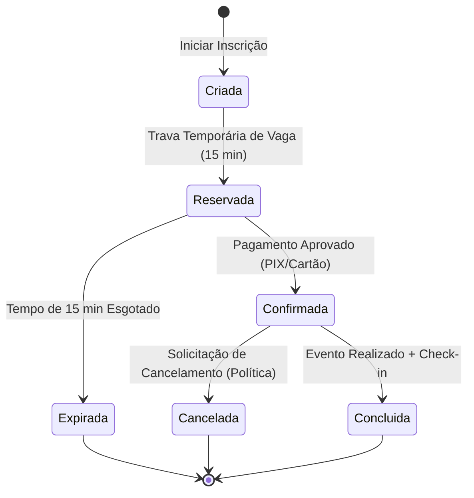
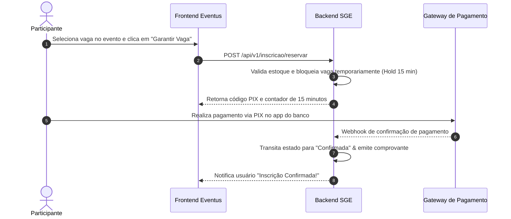

# 📄 Documento de Especificação de Requisitos

**Sistema:** Sistema de Gestão de Eventos (Eventus / SGE)  
**Disciplina:** Engenharia de Requisitos com IA Generativa (ESPT1ESC10 - Unidade 3)  
**Artefato Principal:** Histórias de Usuário (agrupadas por Ator/Stakeholder), Critérios de Aceitação BDD, Diagramas Visuais (Mermaid), Matriz de Rastreabilidade e Tratamento de Lacunas (OB1-OB9)

---

## 1. Introdução e Visão Geral

Este documento apresenta a especificação formal dos requisitos de software para o **Sistema de Gestão de Eventos (Eventus / SGE)**, elaborado a partir da análise das entrevistas de elicitação e refinado com o auxílio de ferramentas de IA Generativa e curadoria humana.

O sistema destina-se a centralizar a criação de eventos, gestão de inscrições, controle concorrencial de vagas, pagamentos assíncronos, gestão de lista de espera, políticas flexíveis de cancelamento/reembolso e emissão automatizada de certificados.

### 👥 Mapeamento dos Perfis de Stakeholders (Atores)
- **Participante:** Usuário final que busca eventos, realiza inscrições, efetua pagamentos, solicita cancelamentos e emite certificados.
- **Organizador:** Responsável por cadastrar eventos, definir capacidade de vagas, configurar parâmetros de políticas e acompanhar relatórios.
- **Equipe Financeira:** Acompanha repasses, confirmações de pagamento assíncronas e liberação de reembolsos.
- **Palestrante:** Acessa a lista de inscritos em seus workshops e estatísticas agregadas de público respeitando a LGPD.
- **Equipe de TI / Administração:** Mantém o ambiente de nuvem, segurança e auditoria do sistema.

---

## 📐 2. Modelagem e Arquitetura Visual (Mermaid)

### 2.1 Máquina de Estados da Inscrição (State Diagram)
O ciclo de vida de uma inscrição evolui de acordo com eventos temporais e financeiros:



### 2.2 Diagrama de Sequência - Reserva Temporária e Pagamento (HU01)



---

## 3. Requisitos Funcionais - Histórias de Usuário por Ator

### 👤 Ator: Participante

#### 📌 HU01 – Inscrição com Trava Temporária de Vaga
- **Prioridade:** Alta | **Estimativa:** 8 Story Points  
- **Descrição:**  
  **Como** participante de um evento  
  **Quero** reservar temporariamente uma vaga durante o processo de checkout  
  **Para** ter a garantia de que não perderei o lugar enquanto concluo o pagamento.

##### 📋 Critérios de Aceitação (BDD)
```gherkin
Cenário 1: Reserva bem-sucedida e confirmação dentro do prazo
  Dado que o evento possui vagas disponíveis
  Quando o participante clica em "Garantir Vaga"
  Então o sistema reserva a vaga pelo prazo de 15 minutos
  E se o pagamento for confirmado dentro de 15 minutos, a vaga torna-se definitiva.

Cenário 2: Expiração de vaga por ausência de pagamento
  Dado que a vaga foi reservada pelo prazo de 15 minutos
  Quando o tempo se esgota sem confirmação de pagamento
  Então a reserva é cancelada automaticamente e a vaga retorna ao estoque.
```

---

#### 📌 HU02 – Cancelamento e Reembolso Condicional
- **Prioridade:** Alta | **Estimativa:** 5 Story Points  
- **Descrição:**  
  **Como** participante inscrito  
  **Quero** solicitar o cancelamento da minha inscrição  
  **Para** receber o reembolso total ou parcial de acordo com a antecedência e os termos do evento.

##### 📋 Critérios de Aceitação (BDD)
```gherkin
Cenário 1: Cancelamento dentro do prazo regulamentado
  Dado que a política do evento permite cancelamento até 48 horas antes da abertura
  Quando o participante solicita o cancelamento com 72 horas de antecedência
  Então a inscrição é cancelada, a vaga é liberada e a devolução do valor é encaminhada ao financeiro.

Cenário 2: Cancelamento negado fora da janela de antecedência
  Dado que faltam menos de 24 horas para o início do evento
  Quando o participante tenta cancelar sua inscrição
  Então o sistema impede o cancelamento com a mensagem "Fora do prazo limite de reembolso".
```

---

#### 📌 HU03 – Fila e Lista de Espera Automática
- **Prioridade:** Média | **Estimativa:** 5 Story Points  
- **Descrição:**  
  **Como** participante interessado em um evento esgotado  
  **Quero** me cadastrar na lista de espera  
  **Para** ser convocado automaticamente caso uma vaga seja liberada por desistência.

##### 📋 Critérios de Aceitação (BDD)
```gherkin
Cenário 1: Convocação por e-mail com tempo limite para aceite
  Dado que uma vaga foi liberada no evento esgotado
  Quando o sistema convoca o 1º colocado da lista de espera enviando um link temporário
  Então o participante tem 24 horas para aceitar e pagar a inscrição antes que o convite expire.
```

---

#### 📌 HU04 – Emissão de Certificado Vinculada ao Check-in
- **Prioridade:** Alta | **Estimativa:** 3 Story Points  
- **Descrição:**  
  **Como** participante presente  
  **Quero** emitir meu certificado digital após o encerramento do evento  
  **Para** comprovar minhas horas de atividades complementares.

##### 📋 Critérios de Aceitação (BDD)
```gherkin
Cenário 1: Emissão autorizada após check-in confirmado
  Dado que o evento foi concluído e o participante possui presença registrada (>= 75%)
  Quando acessa a área de certificados e clica em "Baixar PDF"
  Então o sistema gera o certificado em PDF com selo de autenticidade e QR Code.
```

---

### 👨‍💼 Ator: Organizador

#### 📌 HU05 – Configuração de Políticas do Evento (Perfis de Política)
- **Prioridade:** Alta | **Estimativa:** 8 Story Points  
- **Descrição:**  
  **Como** organizador de eventos  
  **Quero** configurar prazos de cancelamento, regras de reembolso e tempo de retenção de vagas  
  **Para** ajustar o sistema às regras específicas de cada evento antes da abertura das inscrições.

##### 📋 Critérios de Aceitação (BDD)
```gherkin
Cenário 1: Definição de parâmetros de reembolso e cancelamento
  Dado que o organizador está cadastrando um novo evento
  Quando define a janela de cancelamento (ex: 48h) e a porcentagem de reembolso (ex: 80%)
  Então o sistema salva a política e aplica as regras automaticamente aos inscritos desse evento.
```

---

### 🎙️ Ator: Palestrante

#### 📌 HU06 – Consulta de Inscritos e Proteção de Dados (LGPD)
- **Prioridade:** Média | **Estimativa:** 3 Story Points  
- **Descrição:**  
  **Como** palestrante  
  **Quero** visualizar o perfil e o número de participantes da minha sessão  
  **Para** adequar o conteúdo pedagógico sem violar a privacidade dos inscritos.

##### 📋 Critérios de Aceitação (BDD)
```gherkin
Cenário 1: Visualização anonimizada de dados dos participantes
  Dado que o palestrante acessa o painel da sua palestra
  Quando visualiza a lista de inscritos
  Então o sistema exibe apenas cargos, empresas e estatísticas agregadas, ocultando e-mails e CPFs sem consentimento.
```

---

## 4. Requisitos Não-Funcionais (RNF)

| Código | Categoria | Descrição do Requisito | Métrica / Meta |
|:---|:---|:---|:---|
| **RNF01** | **Concorrência** | O sistema deve suportar picos de acessos simultâneos na abertura de inscrições de eventos populares sem duplicar a alocação de vagas. | Controle de locks pessimistas/otimistas no banco (suporte a 500 req/s) |
| **RNF02** | **Segurança & LGPD** | Os dados pessoais dos participantes devem ser protegidos com criptografia e termo de consentimento explícito. | Protocolo TLS 1.3, hashing bcrypt para senhas e conformidade LGPD |
| **RNF03** | **Performance** | O tempo de carregamento de páginas de catálogo e emissão de certificados deve ser ágil. | Tempo de resposta <= 2,0 segundos (LCP < 2.5s) |
| **RNF04** | **Disponibilidade** | O sistema deve estar continuamente operacional durante o período de inscrições de grandes eventos. | SLA de Uptime de 99.9% em ambiente de nuvem |

---

## 5. Análise de Indefinições e Lacunas da Elicitação (OB1 a OB9)

O documento oficial de elicitação trazia 9 pontos declaradamente indefinidos (**OB1 a OB9**). A tabela abaixo demonstra como nossa especificação tratou cada ponto:

| Código | Item Indefinido na Elicitação | Solução Adotada na Especificação |
|:---|:---|:---|
| **OB1** | Prazos de cancelamento e devolução de valores | **Tratado como parâmetro configurável** no Perfil de Política do Evento (HU05). |
| **OB2** | Critérios para funcionamento da lista de espera | **Automação por fila de chegada com convite de 24h** (HU03). |
| **OB3** | Tempo de reserva temporária da vaga durante o pagamento | **Hold temporal fixado em 15 minutos** com liberação automática (HU01). |
| **OB4** | Regras e condições para emissão de certificados | **Condicionado ao registro de check-in / presença mínima (75%)** (HU04). |
| **OB5** | Política de notificação de inscritos | **Envio automatizado de e-mails de confirmação e convites** via serviço assíncrono. |
| **OB6** | Conflito de horário entre workshops simultâneos | **Bloqueio no frontend/backend** impedindo inscrições em horários sobrepostos. |
| **OB7** | Visibilidade de dados de participantes para palestrantes | **Minimização de dados conforme LGPD** (HU06). |
| **OB8** | Formas de pagamento aceitas | **Integração genérica via PIX, Cartão e Boleto** com webhooks assíncronos. |
| **OB9** | Critérios de acessibilidade e desempenho | **Definição de metas quantitativas no RNF02 e RNF03**. |

---

## 6. Glossário do Domínio

- **BDD (Behavior-Driven Development):** Desenvolvimento guiado por comportamento utilizando sintaxe natural Gherkin (*Given-When-Then*).
- **Check-in:** Registro presencial ou online que confirma a presença efetiva do participante no evento.
- **Hold Temporário (Trava de Vaga):** Bloqueio por tempo determinado (ex: 15 min) que garante a vaga do participante enquanto ele conclui o pagamento.
- **LGPD:** Lei Geral de Proteção de Dados (Lei nº 13.709/2018).
- **Lista de Espera (Waitlist):** Fila ordenada que aloca automaticamente vagas liberadas por desistência.
- **Perfil de Política do Evento:** Conjunto de regras parametrizáveis (prazos, reembolsos, limites) configuradas por evento pelo organizador.
- **SGE:** Sistema de Gestão de Eventos.

---

## 7. Matriz de Rastreabilidade (4D)

| Ator / Stakeholder | História de Usuário | Requisito Funcional (RF) | Critério BDD | RNF Relacionado | Lacuna Tratada |
|:---|:---|:---|:---|:---|:---|
| **Participante** | HU01 - Inscrição com Reserva | RF01 - Trava de Vaga | Cenários 1 e 2 | RNF01 (Concorrência) | OB3 (Tempo de reserva) |
| **Participante** | HU02 - Cancelamento/Reembolso | RF02 - Gestão de Cancelamentos | Cenários 1 e 2 | RNF04 (Disponibilidade) | OB1 (Prazos de devolução) |
| **Participante** | HU03 - Lista de Espera | RF03 - Fila Automática | Cenário 1 | RNF03 (Performance) | OB2 (Lista de espera) |
| **Participante** | HU04 - Emissão de Certificado | RF04 - Certificação Digital | Cenários 1 e 2 | RNF02 (Segurança) | OB4 (Certificados) |
| **Organizador** | HU05 - Configuração de Políticas | RF05 - Parametria de Eventos | Cenário 1 | RNF02 (Segurança) | OB1, OB2, OB3 |
| **Palestrante** | HU06 - Consulta LGPD | RF06 - Painel do Palestrante | Cenário 1 | RNF02 (LGPD) | OB7 (Visibilidade de dados) |

---

## 8. Auditoria de Prompts de IA Generativa & Curadoria Humana

| Fase | Prompt Utilizado | Resultado Bruto da IA | Decisão de Curadoria Humana |
|:---|:---|:---|:---|
| **Elicitação** | *"Extraia os requisitos do documento Eventus e agrupe as Histórias de Usuário por ator."* | Gerou 12 histórias soltas sem detalhamento de regras. | **Aprovado & Adaptado:** Agrupamos as HUs pelos 4 atores principais (Participante, Organizador, Financeiro, Palestrante) e adicionamos Story Points. |
| **Tratamento de Lacunas** | *"Como resolver as 9 lacunas (OB1-OB9) de cancelamento e reembolso do documento?"* | Sugeriu inventar um prazo fixo de 24h e reembolso de 50% para todos os eventos. | **Modificado/Corrigido:** Rejeitamos predefinir prazos arbitrários. Criamos o conceito de **Perfil de Política Configurável por Evento** (HU05). |
| **Diagramas Visuais** | *"Gere código Mermaid para a máquina de estados da inscrição e o fluxo de checkout."* | Gerou diagramas sintaticamente válidos para Mermaid. | **Aprovado:** Integrados na seção 2 do documento para renderização automática no GitHub. |
