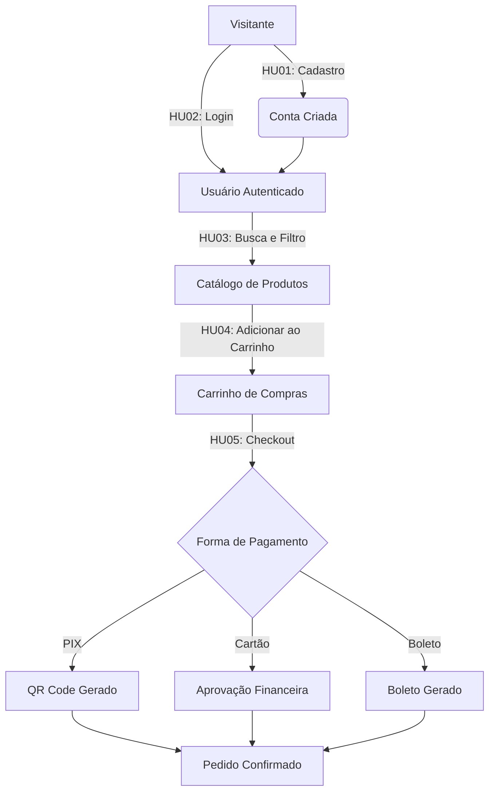
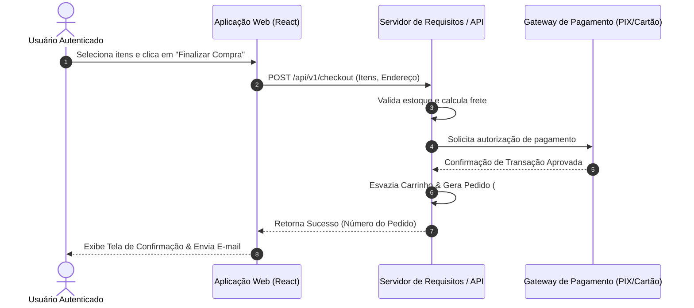

# 📄 Documento de Especificação de Requisitos

**Projeto:** Loja Online Exemplo  
**Disciplina:** Engenharia de Requisitos (ESPT1ESC10 - Unidade 3)  
**Artefato Principal:** Histórias de Usuário, Critérios BDD, Diagramas Visuais (Mermaid), RNFs e Matriz de Rastreabilidade  

---

## 1. Introdução

Este documento apresenta a especificação completa de requisitos de software para a **Loja Online Exemplo**, desenvolvida com o suporte de técnicas de IA Generativa e refinada através de engenharia de requisitos tradicional. 

O objetivo principal deste projeto é demonstrar a elicitação, estruturação, visualização e rastreabilidade de requisitos funcionais e não-funcionais utilizando **Histórias de Usuário**, **Diagramas de Fluxo/Sequência (Mermaid)** e **Critérios de Aceitação em BDD (Behavior-Driven Development / Gherkin)**.

---

## 📐 2. Diagramas de Arquitetura e Fluxo (Mermaid)

Para complementar a especificação textual com modelos visuais dinâmicos, abaixo são apresentados os fluxos de navegação e sequência de pagamentos:

### 2.1 Diagrama de Navegação do Usuário (User Journey Flow)



### 2.2 Diagrama de Sequência - Processamento de Checkout (HU05)



---

## 3. Requisitos Funcionais (Histórias de Usuário)

> 💡 *Nota:* Os arquivos `.feature` executáveis para testes automatizados BDD estão disponíveis na pasta [`features/`](file:///C:/Users/worlo/.gemini/antigravity/scratch/ESPT1ESC10/features).

### 📌 HU01 – Cadastro de Usuário
- **Prioridade:** Alta  
- **Estimativa:** 5 Story Points  
- **Descrição:**  
  **Como** visitante da loja online  
  **Quero** criar uma conta utilizando meu e-mail e uma senha  
  **Para** acessar funcionalidades exclusivas da plataforma e realizar compras.

#### 📋 Critérios de Aceitação (BDD)
```gherkin
Cenário 1: Cadastro realizado com sucesso
  Dado que o visitante está na página de cadastro
  Quando preenche um e-mail válido (ex: cliente@email.com) e uma senha forte (mínimo 8 caracteres)
  E clica em "Cadastrar"
  Então a conta deve ser criada com sucesso
  E o sistema deve exibir a mensagem "Cadastro realizado com sucesso!"
  E enviar um e-mail de confirmação de conta.

Cenário 2: Tentativa de cadastro com e-mail já existente
  Dado que o e-mail "cliente@email.com" já possui cadastro no sistema
  Quando outro visitante tenta utilizar esse mesmo e-mail no formulário
  Então o sistema não deve permitir o cadastro
  E deve exibir a mensagem de erro "Este e-mail já está cadastrado."

Cenário 3: Validação de tamanho mínimo de senha
  Dado que o visitante informa uma senha com menos de 8 caracteres
  Quando ele tenta submeter o formulário
  Então o sistema bloqueia o envio
  E exibe o alerta "A senha deve conter no mínimo 8 caracteres."
```

---

### 📌 HU02 – Autenticação e Login
- **Prioridade:** Alta  
- **Estimativa:** 3 Story Points  
- **Descrição:**  
  **Como** usuário cadastrado  
  **Quero** realizar login com minhas credenciais de acesso  
  **Para** acessar minha área restrita e histórico de pedidos.

#### 📋 Critérios de Aceitação (BDD)
```gherkin
Cenário 1: Login realizado com sucesso
  Dado que o usuário tem uma conta ativa
  Quando informa seu e-mail e senha corretos na página de login
  E clica em "Entrar"
  Então o sistema autentica o usuário com sucesso
  E o redireciona para a página inicial com a sessão iniciada.

Cenário 2: Login com credenciais inválidas (Segurança)
  Dado que o usuário está na página de login
  Quando informa um e-mail ou senha incorretos
  Então o sistema recusa a autenticação
  E exibe a mensagem de erro "E-mail ou senha incorretos."

Cenário 3: Recuperação de senha
  Dado que o usuário esqueceu sua senha de acesso
  Quando clica no link "Esqueci minha senha" e informa o e-mail cadastrado
  Então o sistema envia um e-mail contendo um link com token temporário para redefinição.
```

---

### 📌 HU03 – Consulta e Busca de Produtos
- **Prioridade:** Alta  
- **Estimativa:** 5 Story Points  
- **Descrição:**  
  **Como** usuário da plataforma  
  **Quero** visualizar a lista de produtos, buscar por termo e aplicar filtros  
  **Para** encontrar os itens que desejo comprar com agilidade.

#### 📋 Critérios de Aceitação (BDD)
```gherkin
Cenário 1: Listagem padrão de produtos
  Dado que o usuário acessa a página do catálogo
  Então o sistema deve exibir os produtos em grade com nome, preço, imagem e status de estoque.

Cenário 2: Busca por palavra-chave
  Dado que o usuário digita "Notebook" no campo de busca
  Quando clica no ícone de pesquisa ou pressiona Enter
  Então o sistema filtra e exibe apenas produtos que contenham "Notebook" no título ou descrição.

Cenário 3: Filtragem por categoria e faixa de preço
  Dado que o usuário seleciona a categoria "Informática" e faixa de preço de até R$ 3.000,00
  Quando aplica os filtros
  Então a lista exibe exclusivamente produtos da categoria "Informática" com valor menor ou igual a R$ 3.000,00.
```

---

### 📌 HU04 – Carrinho de Compras
- **Prioridade:** Média  
- **Estimativa:** 5 Story Points  
- **Descrição:**  
  **Como** usuário autenticado  
  **Quero** adicionar e gerenciar produtos no meu carrinho de compras  
  **Para** revisar os itens e valores antes de finalizar o pedido.

#### 📋 Critérios de Aceitação (BDD)
```gherkin
Cenário 1: Adicionar produto ao carrinho
  Dado que o usuário está na página de um produto disponível
  Quando clica no botão "Adicionar ao Carrinho"
  Então o produto é incluído no carrinho
  E o contador de itens no cabeçalho é incrementado em 1.

Cenário 2: Alteração de quantidade e remoção de itens
  Dado que o usuário está na página do carrinho
  Quando altera a quantidade de um item de 1 para 3 ou clica em "Remover"
  Então o subtotal do item e o valor total do carrinho são recalculados instantaneamente.

Cenário 3: Resumo detalhado do carrinho
  Dado que o carrinho possui itens adicionados
  Então o sistema deve exibir o resumo com subtotal, valor do frete calculado e valor total a pagar.
```

---

### 📌 HU05 – Finalização da Compra (Checkout)
- **Prioridade:** Alta  
- **Estimativa:** 8 Story Points  
- **Descrição:**  
  **Como** usuário autenticado  
  **Quero** finalizar o pagamento dos itens do meu carrinho  
  **Para** concluir meu pedido e receber os produtos no meu endereço.

#### 📋 Critérios de Aceitação (BDD)
```gherkin
Cenário 1: Checkout com pagamento via PIX / Cartão / Boleto
  Dado que o usuário está no passo de pagamento do checkout
  Quando seleciona uma forma de pagamento válida (PIX, Cartão de Crédito ou Boleto)
  E confirma o endereço de entrega
  E clica em "Finalizar Pedido"
  Então a transação é processada com a operadora financeira.

Cenário 2: Confirmação e número de pedido
  Dado que o pagamento foi processado com sucesso
  Então o carrinho é esvaziado
  E o sistema exibe a tela de confirmação com o Número do Pedido e o resumo da compra
  E envia o comprovante para o e-mail do cliente.
```

---

## 4. Requisitos Não-Funcionais (RNF)

| Código | Categoria | Descrição do Requisito | Métrica / Meta |
|:---|:---|:---|:---|
| **RNF01** | **Segurança** | As senhas dos usuários devem ser criptografadas no banco de dados e as comunicações protegidas via protocolo HTTPS. | Algoritmo `bcrypt` (fator >= 10) e suporte a TLS 1.3 |
| **RNF02** | **Usabilidade** | A interface do sistema deve ser responsiva e intuitiva em dispositivos móveis e desktops. | Padrão Mobile-First e conformidade com WCAG 2.1 nível AA |
| **RNF03** | **Performance** | O tempo de carregamento das páginas de catálogo e busca deve ser rápido. | Tempo de resposta <= 2 segundos (LCP < 2.5s) |
| **RNF04** | **Disponibilidade** | O sistema deve estar operacional continuamente durante o ano. | Uptime SLA de 99.9% em ambiente de nuvem |

---

## 5. Glossário de Termos

- **BDD (Behavior-Driven Development):** Técnica de desenvolvimento guiado por comportamento que utiliza linguagem natural em formato *Given-When-Then* (Dado-Quando-Então).
- **Checkout:** Processo final de uma compra online, no qual são informados endereço, frete e pagamento.
- **Gherkin:** Linguagem DSL sintática utilizada para descrever critérios de aceitação executáveis.
- **História de Usuário (User Story):** Descrição concisa de uma funcionalidade sob a perspectiva de quem irá utilizá-la.
- **Mermaid:** Ferramenta baseada em Markdown para renderização dinâmica de diagramas de sequência e fluxo no GitHub.
- **MVP (Minimum Viable Product):** Versão enxuta do produto com valor suficiente para ser entregue aos usuários.
- **Story Points:** Unidade abstrata de medida utilizada em metodologias ágeis para estimar o esforço relativo de uma História de Usuário.

---

## 6. Matriz de Rastreabilidade

A matriz abaixo conecta cada História de Usuário aos seus Requisitos Funcionais, Critérios de Aceitação e Requisitos Não-Funcionais associados:

| História de Usuário | Módulo / Requisito Funcional | Critérios de Aceitação Principais | RNFs Relacionados |
|:---|:---|:---|:---|
| **HU01** (Cadastro) | Módulo de Gestão de Usuários | Validação de formato de e-mail, verificação de duplicidade, senha mínima de 8 caracteres. | RNF01 (Segurança), RNF02 (Usabilidade) |
| **HU02** (Login) | Módulo de Autenticação | Login com credenciais válidas, mensagem genérica de erro, redefinição por e-mail. | RNF01 (Segurança), RNF04 (Disponibilidade) |
| **HU03** (Consulta) | Módulo de Catálogo e Busca | Exibição de produtos, busca por palavra-chave, filtros por categoria e preço. | RNF03 (Performance), RNF02 (Usabilidade) |
| **HU04** (Carrinho) | Módulo de Vendas / Carrinho | Adição/remoção de itens, cálculo automático de quantidade, subtotal e frete. | RNF03 (Performance), RNF02 (Usabilidade) |
| **HU05** (Checkout) | Módulo de Pagamentos / Pedidos | Seleção de forma de pagamento (PIX/Cartão/Boleto), confirmação de endereço, geração do número do pedido. | RNF01 (Segurança), RNF03 (Performance), RNF04 (Disponibilidade) |

---

## 7. Registro de Prompts de IA Generativa & Curadoria

| Fase | Prompt Utilizado | Resultado da IA Generativa | Ação de Curadoria Humana |
|:---|:---|:---|:---|
| **Elicitação** | *"Liste as 5 principais histórias de usuário para uma loja virtual em formato Como/Quero/Para."* | Forneceu as HUs de cadastro, login, busca, carrinho e checkout. | **Aprovado:** Mantidas todas as 5 HUs por representarem o fluxo essencial (Happy Path) de e-commerce. |
| **Detalhamento BDD** | *"Escreva critérios de aceitação em formato Gherkin (Dado/Quando/Então) para login e cadastro."* | Escreveu cenários simples de login com sucesso e falha. | **Adaptado:** Incluída a regra de segurança de retornar mensagem genérica de erro para evitar enumeração de contas. |
| **Diagramas Visuais** | *"Crie um diagrama de sequência Mermaid para o fluxo de checkout e um fluxograma de jornada de usuário."* | Gerou código Mermaid para visualização dinâmica direta no GitHub. | **Aprovado:** Integrado ao documento de especificação na seção 2. |
| **Análise de Exceção** | *"Quais falhas podem ocorrer no carrinho de compras e no checkout?"* | Sugeriu suporte a cupom de desconto e login via redes sociais. | **Descartado:** Removidos cupons e login social neste momento para manter o escopo do MVP alinhado às restrições do projeto. |
